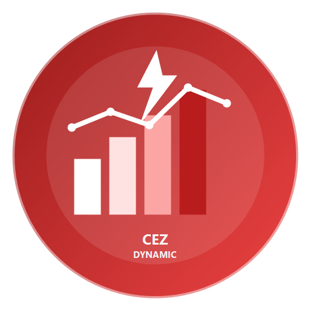

# ČEZ Dynamic Tariff pro Home Assistant

[](https://www.home-assistant.io/)
[](https://hacs.xyz/)

<p align="center">
  
</p>

Vlastní integrace pro Home Assistant, která vystavuje aktuální pásmo ČEZ Dynamického tarifu jako senzory a binární senzor.

## Co integrace umí

- vypočítá aktuální změnu ceny podle pevně daného rozpisu ČEZ
- vystaví aktuální tarifní pásmo, sezónu, typ dne a nejbližší další levné okno
- vystaví pomocné entity:
  - práh levného pásma v %
  - práh super levného pásma v %
  - informaci, zda je právě drahé pásmo
- umí zohlednit české státní svátky jako nepracovní dny

## Instalace do Home Assistantu

### Varianta 1: ruční instalace

Zkopíruj složku:

```text
custom_components/cez_dynamic_tariff
```

do konfigurační složky Home Assistantu:

```text
/config/custom_components/cez_dynamic_tariff
```

Pak restartuj Home Assistant.

Po restartu:

- otevři **Nastavení -> Zařízení a služby**
- klikni na **Přidat integraci**
- najdi **ČEZ Dynamic Tariff**

### Varianta 2: instalace přes HACS

[](https://my.home-assistant.io/redirect/hacs_repository/?owner=79thales&repository=cez-dynamic-tariff&category=integration)

1. Publikuj repozitář na GitHub jako veřejný
2. V Home Assistantu otevři **HACS**
3. Otevři menu **tři tečky**
4. Vyber **Vlastní repozitáře**
5. Vlož URL GitHub repozitáře
6. Vyber typ **Integrace**
7. Přidej repozitář
8. Najdi integraci v HACS a nainstaluj ji
9. Restartuj Home Assistant
10. Otevři **Nastavení -> Zařízení a služby**
11. Přidej integraci **ČEZ Dynamic Tariff**

[](https://my.home-assistant.io/redirect/config_flow_start/?domain=cez_dynamic_tariff)
[](https://my.home-assistant.io/redirect/config/)

## Vytvořené entity

Senzory:

- `sensor.cez_dynamic_tariff_current_modifier`
- `sensor.cez_dynamic_tariff_current_band`
- `sensor.cez_dynamic_tariff_cheap_threshold`
- `sensor.cez_dynamic_tariff_super_cheap_threshold`
- `sensor.cez_dynamic_tariff_season`
- `sensor.cez_dynamic_tariff_day_type`
- `sensor.cez_dynamic_tariff_effective_price`
- `sensor.cez_dynamic_tariff_next_cheap_start`
- `sensor.cez_dynamic_tariff_next_cheap_end`
- `sensor.cez_dynamic_tariff_next_cheap_modifier`
- `sensor.cez_dynamic_tariff_today_tariff_map`

Binární senzory:

- `binary_sensor.cez_dynamic_tariff_expensive_now`

## Poznámky

- `base_price_kwh` je pouze obchodní složka ceny elektřiny
- distribuce, daně, měsíční fixní poplatky a regulované složky se do výpočtu nezapočítávají
- detekce svátků používá Python balíček `holidays`

## Příklad automatizace v Home Assistantu

Tento příklad zapne bojler přes Shelly vždy, když je aktuální tarif na nebo pod nastaveným prahem levného pásma.

```yaml
automation:
  - alias: "Boiler zapnout v levném tarifu"
    mode: single
    triggers:
      - trigger: time_pattern
        minutes: "/5"
    conditions:
      - condition: template
        value_template: >
          {{
            states('sensor.cez_dynamic_tariff_current_modifier') | float(999) <=
            states('sensor.cez_dynamic_tariff_cheap_threshold') | float(-10)
          }}
    actions:
      - action: switch.turn_on
        target:
          entity_id: switch.bojler_nahore_1pm_switch_0
```

Příklad vypnutí po skončení levného pásma:

```yaml
automation:
  - alias: "Boiler vypnout po skončení levného tarifu"
    mode: single
    triggers:
      - trigger: time_pattern
        minutes: "/5"
    conditions:
      - condition: template
        value_template: >
          {{
            states('sensor.cez_dynamic_tariff_current_modifier') | float(999) >
            states('sensor.cez_dynamic_tariff_cheap_threshold') | float(-10)
          }}
    actions:
      - action: switch.turn_off
        target:
          entity_id: switch.bojler_nahore_1pm_switch_0
```

## Příklad Lovelace karty

Pokud chceš jednoduchou přehledovou kartu, vlož do ručně upravované karty tento YAML:

```yaml
type: entities
title: ČEZ Dynamic Tariff
entities:
  - entity: sensor.cez_dynamic_tariff_current_modifier
    name: Změna ceny o
  - entity: sensor.cez_dynamic_tariff_effective_price
    name: Aktuální cena
  - entity: sensor.cez_dynamic_tariff_current_band
    name: Aktuální pásmo
  - entity: sensor.cez_dynamic_tariff_day_type
    name: Typ dne
  - entity: sensor.cez_dynamic_tariff_season
    name: Sezóna
  - entity: sensor.cez_dynamic_tariff_next_cheap_start
    name: Další levné od
  - entity: sensor.cez_dynamic_tariff_next_cheap_end
    name: Další levné do
  - entity: sensor.cez_dynamic_tariff_next_cheap_modifier
    name: Další levný modifier
  - entity: sensor.cez_dynamic_tariff_cheap_threshold
    name: Práh levného pásma
  - entity: sensor.cez_dynamic_tariff_super_cheap_threshold
    name: Práh super levného pásma
  - entity: binary_sensor.cez_dynamic_tariff_expensive_now
    name: Drahé pásmo právě teď
```

## Příklad grafického zobrazení v Lovelace

Pokud chceš grafičtější zobrazení, můžeš použít podmíněné Markdown karty, které se automaticky přepínají podle sezóny a typu dne.

Tento YAML patří do nastavení celého pohledu, kde se upravuje `title` a `cards`:

```yaml
title: ČEZ Dynamic Tariff
cards:
  - type: entities
    title: Aktuální stav
    entities:
      - entity: sensor.cez_dynamic_tariff_current_modifier
        name: Změna ceny o
      - entity: sensor.cez_dynamic_tariff_effective_price
        name: Aktuální cena
      - entity: sensor.cez_dynamic_tariff_current_band
        name: Aktuální pásmo
      - entity: sensor.cez_dynamic_tariff_day_type
        name: Typ dne
      - entity: sensor.cez_dynamic_tariff_season
        name: Sezóna
      - entity: sensor.cez_dynamic_tariff_next_cheap_start
        name: Další levné od
      - entity: sensor.cez_dynamic_tariff_next_cheap_end
        name: Další levné do

  - type: markdown
    title: Legenda
    content: |
      `🟩 -10 %`  `🟢 -50 %`  `⬜ +10 %`  `◻️ +25 %`

  - type: conditional
    conditions:
      - entity: sensor.cez_dynamic_tariff_season
        state: Letní
      - entity: sensor.cez_dynamic_tariff_day_type
        state: Pracovní den
    card:
      type: markdown
      title: Mapa tarifu dnes
      content: |
        **Duben až září / pracovní den**

        `🟩 00:00-02:59` `🟢 03:00-04:59` `◻️ 05:00-07:59`  
        `⬜ 08:00-10:59` `🟢 11:00-13:59` `⬜ 14:00-15:59`  
        `🟩 16:00-17:59` `◻️ 18:00-19:59` `⬜ 20:00-22:59`  
        `🟩 23:00-23:59`

  - type: conditional
    conditions:
      - entity: sensor.cez_dynamic_tariff_season
        state: Letní
      - entity: sensor.cez_dynamic_tariff_day_type
        state: Víkend nebo Svátek
    card:
      type: markdown
      title: Mapa tarifu dnes
      content: |
        **Duben až září / víkend nebo svátek**

        `🟩 00:00-02:59` `🟢 03:00-04:59` `⬜ 05:00-10:59`  
        `🟢 11:00-13:59` `⬜ 14:00-15:59` `🟩 16:00-17:59`  
        `⬜ 18:00-22:59` `🟩 23:00-23:59`

  - type: conditional
    conditions:
      - entity: sensor.cez_dynamic_tariff_season
        state: Zimní
      - entity: sensor.cez_dynamic_tariff_day_type
        state: Pracovní den
    card:
      type: markdown
      title: Mapa tarifu dnes
      content: |
        **Říjen až březen / pracovní den**

        `🟩 00:00-02:59` `🟢 03:00-04:59` `◻️ 05:00-07:59`  
        `⬜ 08:00-10:59` `🟩 11:00-13:59` `⬜ 14:00-15:59`  
        `🟩 16:00-17:59` `◻️ 18:00-19:59` `⬜ 20:00-22:59`  
        `🟩 23:00-23:59`

  - type: conditional
    conditions:
      - entity: sensor.cez_dynamic_tariff_season
        state: Zimní
      - entity: sensor.cez_dynamic_tariff_day_type
        state: Víkend nebo Svátek
    card:
      type: markdown
      title: Mapa tarifu dnes
      content: |
        **Říjen až březen / víkend nebo svátek**

        `🟩 00:00-02:59` `🟢 03:00-04:59` `⬜ 05:00-10:59`  
        `🟩 11:00-13:59` `⬜ 14:00-17:59` `🟩 18:00-19:59`  
        `⬜ 20:00-22:59` `🟩 23:00-23:59`
```

Pokud upravuješ pouze jednu kartu a ne celý pohled, použij jen sekci jedné karty, ne celý blok s `title:` a `cards:`.

## Jednodušší grafická mapa z nového senzoru

Integrace nově vystavuje i senzor:

- `sensor.cez_dynamic_tariff_today_tariff_map`

Ten má v atributech připraveno:

- `display_map` pro přímé vložení do Markdown karty
- `schedule` jako seznam všech dnešních oken
- `legend` s významem barev

Příklad jednoduché Markdown karty:

```yaml
type: markdown
title: Dnešní mapa tarifu
content: |
  **{{ states('sensor.cez_dynamic_tariff_today_tariff_map') }}**

  {{ state_attr('sensor.cez_dynamic_tariff_today_tariff_map', 'display_map') }}
```

## Vzor dashboardu

Níže je ukázka jednoduchého dashboardu ve stylu přehledu, který zobrazuje:

- aktuální stav
- legendu tarifních úrovní
- dnešní mapu tarifu

Tento YAML patří do nastavení celého pohledu:

```yaml
title: ČEZ Dynamic Tariff
cards:
  - type: grid
    columns: 3
    square: false
    cards:
      - type: entities
        title: Aktuální stav
        entities:
          - entity: sensor.cez_dynamic_tariff_current_modifier
            name: Změna ceny o
          - entity: sensor.cez_dynamic_tariff_effective_price
            name: Aktuální cena
          - entity: sensor.cez_dynamic_tariff_current_band
            name: Aktuální pásmo
          - entity: sensor.cez_dynamic_tariff_day_type
            name: Typ dne
          - entity: sensor.cez_dynamic_tariff_season
            name: Sezóna
          - entity: sensor.cez_dynamic_tariff_next_cheap_start
            name: Další levné od
          - entity: sensor.cez_dynamic_tariff_next_cheap_end
            name: Další levné do

      - type: markdown
        title: Legenda
        content: |
          `🟩 -10 %` `🟢 -50 %` `⬜ +10 %` `◻️ +25 %`

      - type: markdown
        title: Mapa tarifu dnes
        content: |
          **Duben až záříŘíjen až březen / {{ states('sensor.cez_dynamic_tariff_day_type') | lower }}**

          {{ state_attr('sensor.cez_dynamic_tariff_today_tariff_map', 'display_map') }}
```
