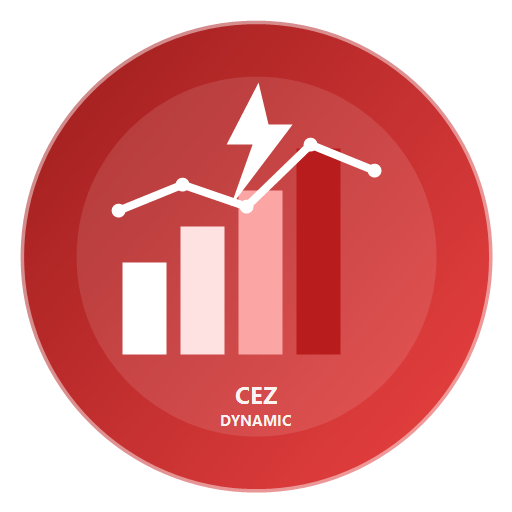

# ČEZ Dynamic Tariff pro Home Assistant

[](https://www.home-assistant.io/)
[](https://hacs.xyz/)
[](https://github.com/79thales/cez-dynamic-tariff/actions/workflows/hacs.yaml)
[](https://github.com/79thales/cez-dynamic-tariff/actions/workflows/hassfest.yaml)
[](https://github.com/79thales/cez-dynamic-tariff/actions/workflows/quality.yaml)

<p align="center">
  
</p>

Vlastní integrace pro Home Assistant, která vystavuje aktuální pásmo ČEZ Dynamického tarifu jako senzory a binární senzor. Výchozí rozvrh je součástí projektu a časová pásma i jejich změny ceny lze upravit přímo v možnostech integrace; integrace nestahuje aktuální ceny z internetu.

Aktuální verze: `0.2.0`

## Požadavky

- Home Assistant `2025.1.0` nebo novější
- HACS (při instalaci přes HACS)
- připojení k internetu pouze při instalaci/aktualizaci závislosti `holidays`

## Co integrace umí

- vypočítá aktuální změnu ceny podle výchozího nebo vlastního rozpisu ČEZ
- vystaví aktuální tarifní pásmo, sezónu, typ dne a nejbližší další levné okno
- vystaví pomocné entity:
  - práh levného pásma v %
  - práh super levného pásma v %
  - práh drahého pásma v %
  - práh velmi drahého pásma v %
  - informaci, zda je právě drahé nebo velmi drahé pásmo
- umí zohlednit české státní svátky jako nepracovní dny
- umožňuje přidávat, odebírat a upravovat tarifní pásma včetně časů a procentních změn ceny

## Instalace do Home Assistantu

### Varianta 1: ruční instalace

Zkopíruj složku:

```text
custom_components/cez_dynamic_tariff
```

do konfigurační složky Home Assistantu:

```text
/config/custom_components/cez_dynamic_tariff
```

Pak restartuj Home Assistant.

Po restartu:

- otevři **Nastavení -> Zařízení a služby**
- klikni na **Přidat integraci**
- najdi **ČEZ Dynamic Tariff**

### Varianta 2: instalace přes HACS

[](https://my.home-assistant.io/redirect/hacs_repository/?owner=79thales&repository=cez-dynamic-tariff&category=integration)

Pokud repozitář ještě není ve výchozím katalogu HACS, přidej jej jako vlastní repozitář:

1. Otevři **HACS**.
2. Otevři nabídku **tři tečky**.
3. Vyber **Vlastní repozitáře**.
4. Vlož `https://github.com/79thales/cez-dynamic-tariff`.
5. Vyber typ **Integrace** a repozitář přidej.
6. Integraci nainstaluj a restartuj Home Assistant.
7. Otevři **Nastavení → Zařízení a služby → Přidat integraci**.
8. Vyhledej **ČEZ Dynamic Tariff**.

Po zařazení do výchozího katalogu HACS bude možné přeskočit krok s vlastním repozitářem.

[](https://my.home-assistant.io/redirect/config_flow_start/?domain=cez_dynamic_tariff)
[](https://my.home-assistant.io/redirect/config/)

## Nastavení tarifních pásem

Otevři **Nastavení → Zařízení a služby → Integrace → ČEZ Dynamic Tariff → Konfigurovat**. Ve formuláři jsou čtyři samostatné denní rozvrhy:

- zimní pracovní den,
- zimní víkend nebo svátek,
- letní pracovní den,
- letní víkend nebo svátek.

Každý rozvrh obsahuje položky ve formátu `HH:MM=změna_v_procentech`, oddělené čárkou. Například:

```text
00:00=-10, 03:00=-50, 05:00=+25, 08:00=+10
```

Tento příklad znamená:

- od `00:00` změnu ceny `-10 %`,
- od `03:00` změnu ceny `-50 %`,
- od `05:00` změnu ceny `+25 %`,
- od `08:00` změnu ceny `+10 %` až do půlnoci.

Pravidla rozvrhu:

- první položka musí začínat v `00:00`,
- časy musí být seřazené a nesmí se opakovat,
- změna ceny musí být celé číslo; znaménko `+` je volitelné,
- další čas automaticky ukončí předchozí pásmo,
- počet položek není pevný.

### Ověřené výchozí rozvrhy

**Říjen až březen – pracovní den**

```text
00:00=-10, 03:00=-50, 05:00=+25, 08:00=+10, 11:00=-10, 14:00=+10, 16:00=-10, 18:00=+25, 20:00=+10, 23:00=-10
```

**Říjen až březen – víkend nebo svátek**

```text
00:00=-10, 03:00=-50, 05:00=+10, 11:00=-10, 14:00=+10, 16:00=-10, 18:00=+10, 23:00=-10
```

**Duben až září – pracovní den**

```text
00:00=-10, 03:00=-50, 05:00=+25, 08:00=+10, 11:00=-50, 14:00=+10, 16:00=-10, 18:00=+25, 20:00=+10, 23:00=-10
```

**Duben až září – víkend nebo svátek**

```text
00:00=-10, 03:00=-50, 05:00=+10, 11:00=-50, 14:00=+10, 16:00=-10, 18:00=+10, 23:00=-10
```

Začátek intervalu je včetně a konec bez následujícího okamžiku. Zápis `03:00=-50, 05:00=+25` tedy znamená `-50 %` od `03:00:00` do `04:59:59…`; přesně v `05:00:00` začne `+25 %`. Poslední položka platí do půlnoci.

Pokud ČEZ zavede další pásmo, vlož do příslušného rozvrhu další položku, například `12:30=+5`. Pásmo odebereš odstraněním jeho položky. Volba **Obnovit výchozí rozvrhy z projektu** zahodí vlastní časy i procentní změny a načte výchozí hodnoty integrace.

Integrace změny sazebníku nestahuje automaticky. Nové oficiální pásmo proto můžeš ihned zadat ručně; výchozí rozvrhy projektu se následně upraví v nové verzi integrace.

Starší uložený formát obsahující jen časy je nadále podporovaný. Při otevření a uložení nastavení se automaticky převede na úplný formát s procentními změnami.

### Rozdíl mezi pásmem a prahem

- **Tarifní pásmo** je položka v denním rozvrhu. Určuje čas začátku a skutečnou procentní změnu ceny, například `12:30=+5`.
- **Práh** neurčuje čas ani cenu. Pouze zařadí skutečnou změnu do kategorie, nastaví barvu mapy a ovlivní příslušné binární senzory a automatizace.

Výchozí klasifikace:

| Kategorie | Výchozí rozsah | Zobrazení |
|---|---:|---|
| Super levné | `≤ -50 %` | 🟢 |
| Levné | `> -50 %` a `≤ -10 %` | 🟩 |
| Běžné | `> -10 %` a `< +10 %` | ▫️ |
| Drahé | `≥ +10 %` a `< +25 %` | ⬜ |
| Velmi drahé | `≥ +25 %` | ◻️ |

Hodnota `+25 %` je součástí výchozích rozvrhů pro pracovní dny od `05:00` a `18:00`. Výchozí víkendové/sváteční rozvrhy ji nepoužívají, ale lze ji do nich ručně přidat. Při `+25 %` jsou aktivní oba binární senzory: **drahé** i **velmi drahé**.

Změna prahu nemění cenu ani časový rozvrh; mění pouze klasifikaci pásem pro senzory, barvy a automatizace.

## Vytvořené entity

Senzory:

- `sensor.cez_dynamic_tariff_current_modifier`
- `sensor.cez_dynamic_tariff_current_band`
- `sensor.cez_dynamic_tariff_cheap_threshold`
- `sensor.cez_dynamic_tariff_super_cheap_threshold`
- `sensor.cez_dynamic_tariff_expensive_threshold`
- `sensor.cez_dynamic_tariff_very_expensive_threshold`
- `sensor.cez_dynamic_tariff_season`
- `sensor.cez_dynamic_tariff_day_type`
- `sensor.cez_dynamic_tariff_effective_price`
- `sensor.cez_dynamic_tariff_next_cheap_start`
- `sensor.cez_dynamic_tariff_next_cheap_end`
- `sensor.cez_dynamic_tariff_next_cheap_modifier`
- `sensor.cez_dynamic_tariff_today_tariff_map`

Binární senzory:

- `binary_sensor.cez_dynamic_tariff_expensive_now`
- `binary_sensor.cez_dynamic_tariff_very_expensive_now`

## Poznámky

- `base_price_kwh` je pouze obchodní složka ceny elektřiny
- distribuce, daně, měsíční fixní poplatky a regulované složky se do výpočtu nezapočítávají
- detekce svátků používá Python balíček `holidays`
- základní cena `0` znamená, že se efektivní cena nevypočítává
- všechny čtyři prahy `-50/-10/+10/+25 %` lze změnit v nastavení integrace
- časová pásma a jejich změny ceny lze změnit v **Nastavení → Zařízení a služby → Integrace → ČEZ Dynamic Tariff → Konfigurovat**
- zaškrtnutím **Obnovit výchozí rozvrhy z projektu** se vlastní časy i změny ceny zahodí

## Vydání nové verze

Verze integrace je uvedena v `custom_components/cez_dynamic_tariff/manifest.json`. Pro vydání nové verze:

1. Změň verzi v `manifest.json`.
2. Nech projít workflow HACS validation, Hassfest a Quality.
3. Vytvoř GitHub Release se stejnou verzí, například `v0.2.0`.

Pouhé vytvoření Git tagu bez GitHub Release nemusí HACS rozpoznat jako vydání.

## Vývoj a kontrola

Lokální kontrola syntaxe:

```bash
python -m compileall -q custom_components
```

Kontrola Ruff:

```bash
ruff check custom_components
```

Pull requesty a vydání automaticky kontrolují HACS, Hassfest a Ruff přes GitHub Actions.

## Příklad automatizace v Home Assistantu

Tento příklad zapne bojler přes Shelly vždy, když je aktuální tarif na nebo pod nastaveným prahem levného pásma.

```yaml
automation:
  - alias: "Boiler zapnout v levném tarifu"
    mode: single
    triggers:
      - trigger: time_pattern
        minutes: "/5"
    conditions:
      - condition: template
        value_template: >
          {{
            states('sensor.cez_dynamic_tariff_current_modifier') | float(999) <=
            states('sensor.cez_dynamic_tariff_cheap_threshold') | float(-10)
          }}
    actions:
      - action: switch.turn_on
        target:
          entity_id: switch.bojler_nahore_1pm_switch_0
```

Příklad vypnutí po skončení levného pásma:

```yaml
automation:
  - alias: "Boiler vypnout po skončení levného tarifu"
    mode: single
    triggers:
      - trigger: time_pattern
        minutes: "/5"
    conditions:
      - condition: template
        value_template: >
          {{
            states('sensor.cez_dynamic_tariff_current_modifier') | float(999) >
            states('sensor.cez_dynamic_tariff_cheap_threshold') | float(-10)
          }}
    actions:
      - action: switch.turn_off
        target:
          entity_id: switch.bojler_nahore_1pm_switch_0
```

## Příklad Lovelace karty

Pokud chceš jednoduchou přehledovou kartu, vlož do ručně upravované karty tento YAML:

```yaml
type: entities
title: ČEZ Dynamic Tariff
entities:
  - entity: sensor.cez_dynamic_tariff_current_modifier
    name: Změna ceny o
  - entity: sensor.cez_dynamic_tariff_effective_price
    name: Aktuální cena
  - entity: sensor.cez_dynamic_tariff_current_band
    name: Aktuální pásmo
  - entity: sensor.cez_dynamic_tariff_day_type
    name: Typ dne
  - entity: sensor.cez_dynamic_tariff_season
    name: Sezóna
  - entity: sensor.cez_dynamic_tariff_next_cheap_start
    name: Další levné od
  - entity: sensor.cez_dynamic_tariff_next_cheap_end
    name: Další levné do
  - entity: sensor.cez_dynamic_tariff_next_cheap_modifier
    name: Další levný modifier
  - entity: sensor.cez_dynamic_tariff_cheap_threshold
    name: Práh levného pásma
  - entity: sensor.cez_dynamic_tariff_super_cheap_threshold
    name: Práh super levného pásma
  - entity: sensor.cez_dynamic_tariff_expensive_threshold
    name: Práh drahého pásma
  - entity: sensor.cez_dynamic_tariff_very_expensive_threshold
    name: Práh velmi drahého pásma
  - entity: binary_sensor.cez_dynamic_tariff_expensive_now
    name: Drahé pásmo právě teď
  - entity: binary_sensor.cez_dynamic_tariff_very_expensive_now
    name: Velmi drahé pásmo právě teď
```

## Grafická mapa pásem v Lovelace

Integrace vystavuje senzor:

- `sensor.cez_dynamic_tariff_today_tariff_map`

Ten má v atributech připraveno:

- `display_map` pro přímé vložení do Markdown karty
- `schedule` jako seznam všech dnešních oken
- `legend` sestavenou ze všech procentních změn použitých v dnešním rozvrhu

Mapa i legenda se automaticky přizpůsobí vlastním časům, změnám ceny a nově přidaným pásmům. Příklad Markdown karty:

```yaml
type: markdown
title: Dnešní mapa tarifu
content: |
  **{{ states('sensor.cez_dynamic_tariff_today_tariff_map') }}**

  {{ state_attr('sensor.cez_dynamic_tariff_today_tariff_map', 'display_map') }}

  
  `{{ item['token'] }} {{ item['modifier_percent'] }} %`
  
```

## Doporučený dashboard

Tento dashboard je plně dynamický. Neobsahuje natvrdo zapsaná pásma ani hodnoty `-50/-10/+10/+25`; mapu a legendu čte z integrace, takže se automaticky přizpůsobí vlastnímu rozvrhu i případnému novému pásmu.

YAML vlož do editoru YAML jednoho pohledu. Pokud se tvoje ID entit liší, vyber odpovídající entity ve vizuálním editoru:

```yaml
title: ČEZ Dynamic Tariff
path: cez-dynamic-tariff
icon: mdi:transmission-tower
cards:
  - type: grid
    columns: 2
    square: false
    cards:
      - type: entities
        title: Aktuální tarif
        state_color: true
        show_header_toggle: false
        entities:
          - entity: sensor.cez_dynamic_tariff_current_modifier
            name: Změna ceny
          - entity: sensor.cez_dynamic_tariff_effective_price
            name: Efektivní cena
          - entity: sensor.cez_dynamic_tariff_current_band
            name: Čas aktuálního pásma
          - entity: sensor.cez_dynamic_tariff_day_type
            name: Typ dne
          - entity: sensor.cez_dynamic_tariff_season
            name: Sezóna
          - entity: binary_sensor.cez_dynamic_tariff_expensive_now
            name: Drahé pásmo
          - entity: binary_sensor.cez_dynamic_tariff_very_expensive_now
            name: Velmi drahé pásmo (+25 %)

      - type: entities
        title: Nastavené prahy
        show_header_toggle: false
        entities:
          - entity: sensor.cez_dynamic_tariff_super_cheap_threshold
            name: Super levné
          - entity: sensor.cez_dynamic_tariff_cheap_threshold
            name: Levné
          - entity: sensor.cez_dynamic_tariff_expensive_threshold
            name: Drahé
          - entity: sensor.cez_dynamic_tariff_very_expensive_threshold
            name: Velmi drahé

      - type: entities
        title: Další levné okno
        show_header_toggle: false
        entities:
          - entity: sensor.cez_dynamic_tariff_next_cheap_start
            name: Začátek
          - entity: sensor.cez_dynamic_tariff_next_cheap_end
            name: Konec
          - entity: sensor.cez_dynamic_tariff_next_cheap_modifier
            name: Změna ceny

      - type: markdown
        title: Dnešní mapa a legenda
        content: |
          **{{ states('sensor.cez_dynamic_tariff_season') }} / {{ states('sensor.cez_dynamic_tariff_day_type') | lower }}**

          {{ state_attr('sensor.cez_dynamic_tariff_today_tariff_map', 'display_map') or 'Mapa zatím není dostupná.' }}

          **Legenda**
          
          `{{ item['token'] }} {{ item['modifier_percent'] }} %`
          
```
